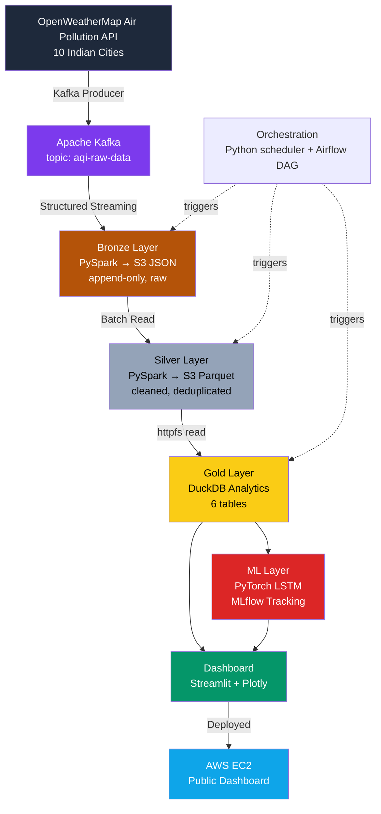

# India AQI Data Lake 🌫️

An end-to-end, production-style data engineering pipeline that ingests, processes, analyze and forecasts Air Quality Index (AQI) data for 10 major Indian cities — built to demonstrate the full skill set expected of a Data Engineer / ML Engineer: streaming ingestion, medallion architecture, orchestration, ML forecasting and cloud deployment.

**Built by:** Arish

---

## Why I Built This

I wanted a project that didn't just "call an API and make a chart" — I wanted to actually build the kind of data platform that companies like Amazon, Flipkart or JP Morgan run internally: multiple layers of data quality, real streaming infrastructure, a model on top and a real (if cost-conscious) cloud deployment. This project follows directly from an earlier one I built — This project goes further: full medallion architecture, batch + streaming hybrid processing, ML forecasting, and orchestration.

---

## System Architecture



**Medallion Architecture in one line:** raw data gets progressively cleaner and more valuable as it moves from Bronze → Silver → Gold, the same pattern used at scale by real data platforms.

---

## Tech Stack

| Layer | Tools |
|---|---|
| Ingestion | FastAPI, Pydantic v2, OpenWeatherMap API |
| Streaming | Apache Kafka (Docker), kafka-python-ng |
| Processing | PySpark (Structured Streaming + Batch) |
| Storage | AWS S3 (Bronze JSON, Silver Parquet) |
| Analytics | DuckDB (httpfs, SQL) |
| ML | PyTorch (LSTM), MLflow |
| Orchestration | Python `schedule`, Apache Airflow (DAG) |
| Dashboard | Streamlit, Plotly |
| Cloud | AWS EC2, S3, IAM |

---

## Gold Layer — 6 Analytics Tables

1. `top_polluted_cities` — top 5 cities by average AQI
2. `city_aqi_summary` — min/max/avg AQI, PM2.5, PM10 per city
3. `aqi_category_distribution` — city counts + percentage per AQI category (window function)
4. `most_dangerous_pollutant` — dominant pollutant per city (PM2.5 vs PM10 vs NO2 vs SO2)
5. `hourly_aqi_trend` — AQI trend grouped by hour
6. `city_health_risk_score` — custom formula: `AQI×0.5 + PM2.5×0.3 + NO2×0.2` → CRITICAL / HIGH / MODERATE / LOW

---

## Machine Learning Layer

- **Model:** 2-layer LSTM (hidden size 64), forecasting AQI from `avg_aqi`, `avg_pm25`, `avg_pm10`
- **Tracking:** MLflow logs parameters, training loss, and MAE for every run — I compared two training runs (`bald-horse-856` vs `gentle-shrimp-601`) to validate consistency
- **Result:** MAE ≈ 76.6 AQI units on ~60 records — expected given the small dataset; accuracy improves as the scheduler collects more data over time


---

## Cloud Deployment

I deployed the **dashboard (serving layer)** to a live AWS EC2 instance to prove the pipeline's output is genuinely cloud-reachable, not just a local demo.

**Deliberate architecture decision:** Kafka and PySpark stay local during development; only the lightweight Streamlit dashboard — reading pre-computed Gold-layer data from DuckDB — runs on EC2. This mirrors a real-world pattern: heavy batch/streaming infrastructure and lightweight serving layers are often deployed and scaled independently. It was also the pragmatic choice given my AWS account's free-tier compute limits (more on that below).

The instance was intentionally short-lived: launched, verified, screenshotted, and terminated — to keep this a $0.17-a-month project, not a forgotten bill.


**S3 storage** confirms the medallion architecture's Bronze and Silver layers genuinely exist in the cloud, not just on my laptop:


**Local dashboard run**, showing the full LSTM forecasting section (which needs `torch` + `mlflow`, deliberately not installed on the lightweight EC2 instance):


---

## Bugs I Hit and Fixed

Building this end-to-end surfaced real engineering problems — not textbook ones. Here are the ones that taught me the most.

### 1. Silver layer crashed reading fields that didn't exist yet
**Error:** My Bronze layer stores the whole AQI payload as one big JSON string, inside a column called `raw_json` — it's not split into separate columns. My Silver script tried to read fields like `aqi` and `pm25` directly, before ever unpacking that JSON string, so every field access failed.
**Fix:** I made sure `parse_raw_json()` always runs *first*, before any cleaning step touches individual fields. Kafka wraps data in an envelope, Bronze keeps that envelope sealed, and Silver has to open it before doing anything else.

### 2. OpenWeatherMap's AQI scale didn't match India's real scale
**Error:** OWM returns AQI as a simple 1–5 index, not the 0–500 scale India's CPCB actually uses. My first attempt — just multiplying by 100 — gave numbers that didn't match real city readings at all.
**Fix:** I built a lookup table calibrated against real AQI values for Indian cities:
```python
OWM_TO_CPCB = {1: 35, 2: 75, 3: 150, 4: 250, 5: 400}
```
Then I checked the output against actual reported AQI for cities like Delhi and Mumbai to confirm it was accurate, not just a number that looked plausible.

### 3. EC2 ran out of disk space installing the full pipeline
**Error:** My first EC2 deploy attempt ran `pip install -r requirements.txt`, which includes PySpark — a 317MB download that needs even more space to unpack. My 8GB EC2 disk, already running Ubuntu, hit `OSError: Disk quota exceeded` partway through.
**Fix:** I realized the dashboard only actually needs `streamlit`, `duckdb`, `pandas`, and `plotly` — it never touches PySpark or Kafka directly, since it just reads pre-computed results from a DuckDB file. So I installed only what the dashboard needed. This turned a failure into a real architecture decision: **separate the serving layer from the processing layer** — the same pattern real companies use so a lightweight dashboard doesn't need the same infrastructure as heavy batch processing.

### 4. PySpark silently failed on Windows without Hadoop binaries
**Error:** PySpark expects a Hadoop-style filesystem layer even on Windows, provided by a file called `winutils.exe`. Without it set up correctly, Spark jobs failed with confusing native-library errors that gave no clear clue what was actually wrong.
**Fix:** I set `HADOOP_HOME=C:\hadoop` and added `C:\hadoop\bin` to `PATH` at the process level, every time, before running any Spark job. This taught me that "works on my machine" isn't the same as "works in production" — environment setup is part of the job, not a footnote.

### 5. Kafka client crashed on Python 3.12
**Error:** The standard `kafka-python` library has a known bug that crashes immediately on import when used with Python 3.12.
**Fix:** I switched to `kafka-python-ng`, a community-maintained fork with the same API but active compatibility fixes. Zero code changes needed — just a smarter dependency choice.

### 6. Windows SSH key permissions blocked EC2 login
**Error:** Connecting to my EC2 instance kept failing with `Permission denied (publickey)`, even with the correct key file. Windows, by default, gives `.pem` files much broader permissions than SSH allows — and my first fix attempt with `icacls` accidentally left behind a stray, unresolved user entry that caused a second, different failure.
**Fix:** I used Windows' **Advanced Security Settings** to make sure exactly one account — my own, Read-only — had access to the key file, with nothing else attached. Once permissions were clean, SSH connected right away.

### 7. PySpark streaming timeout was killing my orchestrator
**Error:** My Bronze layer runs as a continuous PySpark Structured Streaming job — it's supposed to keep running, not finish and exit. My orchestration scheduler was treating the subprocess's `TimeoutExpired` (which happens naturally when a healthy stream is still running) as a crash, and kept marking successful runs as failures.
**Fix:** I updated the scheduler to catch `TimeoutExpired` and treat it as a **success signal** for streaming jobs specifically, since a stream that's still running is behaving exactly as expected. This taught me the difference between "the job failed" and "the job is a long-running process behaving normally" — a distinction that matters a lot in real streaming systems.

---

## Project Structure

```
india-aqi-data-lake/
├── ingestion/          # FastAPI + OWM API + Kafka producer
├── bronze/             # PySpark Structured Streaming → S3 JSON
├── silver/             # PySpark batch cleaning → S3 Parquet
├── gold/               # DuckDB analytics (6 tables)
├── ml/                 # PyTorch LSTM + MLflow tracking
├── orchestration/      # Python scheduler + Airflow DAG
├── dashboard/          # Streamlit + Plotly UI
├── config/             # Environment + settings
├── docs/screenshots/   # Deployment evidence
├── docker-compose.yml  # Kafka + Zookeeper (local)
└── requirements.txt
```

---

## How to Run Locally

```bash
# 1. Start Kafka + Zookeeper
docker-compose up -d

# 2. Set Spark environment (Windows)
set HADOOP_HOME=C:\hadoop
set PATH=%PATH%;C:\hadoop\bin

# 3. Run the full pipeline
python -m orchestration.scheduler

# 4. Launch the dashboard
streamlit run dashboard/app.py

# 5. View ML experiment tracking
mlflow ui
```

---

## What's Next

- Feed the scheduler more days of real data to improve LSTM accuracy beyond the current 76.6 MAE
- Short Snowflake trial to replace DuckDB for the resume-facing version of this project
- Continued interview prep: explaining this architecture end-to-end and the debugging journey above, without notes
