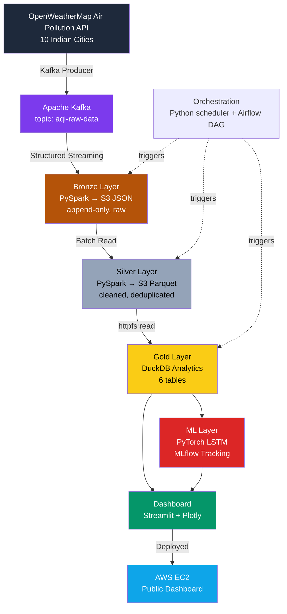

# India AQI Data Lake 🌫️

An end-to-end, production-style data engineering pipeline that ingests, processes, analyzes, and forecasts Air Quality Index (AQI) data for 10 major Indian cities — built to demonstrate the full skill set expected of a Data Engineer / ML Engineer: streaming ingestion, medallion architecture, orchestration, ML forecasting, and cloud deployment.

**Built by:** Arish Mahammad — B.Tech CSE (Data Science), IEM New Town Kolkata

---

## Why I Built This

I wanted a project that didn't just "call an API and make a chart" — I wanted to actually build the kind of data platform that companies like Amazon, Flipkart, or JP Morgan run internally: multiple layers of data quality, real streaming infrastructure, a model on top, and a real (if cost-conscious) cloud deployment. This project follows directly from an earlier one I built — a **Realtime Crypto Data Platform** — which taught me streaming fundamentals. This project goes further: full medallion architecture, batch + streaming hybrid processing, ML forecasting, and orchestration.

---

## System Architecture



**Medallion Architecture in one line:** raw data gets progressively cleaner and more valuable as it moves from Bronze → Silver → Gold, the same pattern used at scale by real data platforms.

---

## Tech Stack

| Layer | Tools |
|---|---|
| Ingestion | FastAPI, Pydantic v2, OpenWeatherMap API |
| Streaming | Apache Kafka (Docker), kafka-python-ng |
| Processing | PySpark (Structured Streaming + Batch) |
| Storage | AWS S3 (Bronze JSON, Silver Parquet) |
| Analytics | DuckDB (httpfs, SQL) |
| ML | PyTorch (LSTM), MLflow |
| Orchestration | Python `schedule`, Apache Airflow (DAG) |
| Dashboard | Streamlit, Plotly |
| Cloud | AWS EC2, S3, IAM |

---

## Gold Layer — 6 Analytics Tables

1. `top_polluted_cities` — top 5 cities by average AQI
2. `city_aqi_summary` — min/max/avg AQI, PM2.5, PM10 per city
3. `aqi_category_distribution` — city counts + percentage per AQI category (window function)
4. `most_dangerous_pollutant` — dominant pollutant per city (PM2.5 vs PM10 vs NO2 vs SO2)
5. `hourly_aqi_trend` — AQI trend grouped by hour
6. `city_health_risk_score` — custom formula: `AQI×0.5 + PM2.5×0.3 + NO2×0.2` → CRITICAL / HIGH / MODERATE / LOW

---

## Machine Learning Layer

- **Model:** 2-layer LSTM (hidden size 64), forecasting AQI from `avg_aqi`, `avg_pm25`, `avg_pm10`
- **Tracking:** MLflow logs parameters, training loss, and MAE for every run — I compared two training runs (`bald-horse-856` vs `gentle-shrimp-601`) to validate consistency
- **Result:** MAE ≈ 76.6 AQI units on ~60 records — expected given the small dataset; accuracy improves as the scheduler collects more data over time


---

## Cloud Deployment

I deployed the **dashboard (serving layer)** to a live AWS EC2 instance to prove the pipeline's output is genuinely cloud-reachable, not just a local demo.

**Deliberate architecture decision:** Kafka and PySpark stay local during development; only the lightweight Streamlit dashboard — reading pre-computed Gold-layer data from DuckDB — runs on EC2. This mirrors a real-world pattern: heavy batch/streaming infrastructure and lightweight serving layers are often deployed and scaled independently. It was also the pragmatic choice given my AWS account's free-tier compute limits (more on that below).

The instance was intentionally short-lived: launched, verified, screenshotted, and terminated — to keep this a $0.17-a-month project, not a forgotten bill.


**S3 storage** confirms the medallion architecture's Bronze and Silver layers genuinely exist in the cloud, not just on my laptop:


**Local dashboard run**, showing the full LSTM forecasting section (which needs `torch` + `mlflow`, deliberately not installed on the lightweight EC2 instance):


---

## Bugs I Hit and Fixed

Building this end-to-end surfaced real engineering problems — not textbook ones. Here are the ones that taught me the most.

### 1. OpenWeatherMap's AQI scale doesn't match India's CPCB scale
OWM returns AQI as a 1–5 index, not the 0–500 CPCB scale India actually uses. My first instinct — multiplying by 100 — produced wrong values that didn't match real-world city readings. I fixed it with a proper lookup table calibrated against known city AQI values:
```python
OWM_TO_CPCB = {1: 35, 2: 75, 3: 150, 4: 250, 5: 400}
```

### 2. Silver layer crashed reading fields that didn't exist yet
My Bronze layer stores the full AQI payload as a **JSON string** inside a `raw_json` column — not as separate columns. My Silver cleaning script tried to filter and deduplicate on fields like `aqi` and `pm25` before parsing that JSON string, so every field access failed. The fix was ordering: `parse_raw_json()` must always run *before* any other cleaning step touches individual fields.

### 3. Kafka client crashed on Python 3.12
The standard `kafka-python` library has a known incompatibility with Python 3.12 that causes hard crashes on import. Switching to the community-maintained `kafka-python-ng` fork resolved it with zero code changes — same API, active compatibility patches.

### 4. PySpark on Windows silently failed without Hadoop binaries
PySpark expects a Linux/Hadoop-style filesystem layer even on Windows, via `winutils.exe`. Without `HADOOP_HOME` set correctly at the process level before every Spark job, jobs failed with cryptic native-library errors. I standardized on setting `HADOOP_HOME=C:\hadoop` and appending `C:\hadoop\bin` to `PATH` before every run.

### 5. `pandas.Styler.applymap` deprecated in newer pandas
When I deployed to EC2, the freshest available `pip install pandas` pulled a much newer version than what I'd tested locally, and `Styler.applymap()` — used to color-code my health risk table — had been renamed to `Styler.map()`. A one-line fix, but a good reminder that "works on my machine" isn't the same as "works in production," especially with unpinned dependency versions.

### 6. EC2 disk quota exceeded trying to install the full pipeline
My first attempt at deploying the dashboard tried to `pip install -r requirements.txt`, which includes PySpark (a 317MB download that needs even more space to unpack). On an 8GB EC2 disk already running Ubuntu, this failed with `OSError: Disk quota exceeded`. Since the dashboard only imports `streamlit`, `duckdb`, `pandas`, and `plotly` — not PySpark or Kafka at all — I installed only what was actually needed. This turned into the architecture decision described above: separate the serving layer from the processing layer, both technically and operationally.

### 7. Windows SSH key permissions blocked by leftover ACL entries
Connecting to EC2 via SSH kept failing with `Permission denied (publickey)` even with the correct key file, because Windows' default file permissions are far more permissive than SSH allows. Running `icacls` to strip inherited permissions once left a stray, unresolved security identifier behind, which caused a second silent failure. The real fix was using **Advanced Security Settings** in Windows to ensure exactly one principal — my own user account, Read-only — had access to the `.pem` file.

---

## Project Structure

```
india-aqi-data-lake/
├── ingestion/          # FastAPI + OWM API + Kafka producer
├── bronze/             # PySpark Structured Streaming → S3 JSON
├── silver/             # PySpark batch cleaning → S3 Parquet
├── gold/               # DuckDB analytics (6 tables)
├── ml/                 # PyTorch LSTM + MLflow tracking
├── orchestration/      # Python scheduler + Airflow DAG
├── dashboard/          # Streamlit + Plotly UI
├── config/             # Environment + settings
├── docs/screenshots/   # Deployment evidence
├── docker-compose.yml  # Kafka + Zookeeper (local)
└── requirements.txt
```

---

## How to Run Locally

```bash
# 1. Start Kafka + Zookeeper
docker-compose up -d

# 2. Set Spark environment (Windows)
set HADOOP_HOME=C:\hadoop
set PATH=%PATH%;C:\hadoop\bin

# 3. Run the full pipeline
python -m orchestration.scheduler

# 4. Launch the dashboard
streamlit run dashboard/app.py

# 5. View ML experiment tracking
mlflow ui
```

---

## What's Next

- Feed the scheduler more days of real data to improve LSTM accuracy beyond the current 76.6 MAE
- Short Snowflake trial to replace DuckDB for the resume-facing version of this project
- Continued interview prep: explaining this architecture end-to-end, and the debugging journey above, without notes
